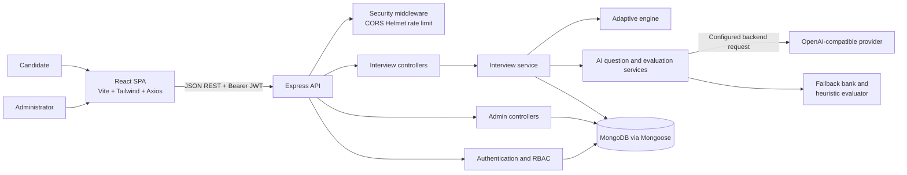

# Architecture Overview

## Architectural style

The platform is a modular full-stack single-page application with a JSON REST
API. The React frontend is responsible for presentation and interaction. The
Express backend is the authority for authentication, authorization, validation,
interview state, adaptive decisions, AI boundaries, persistence, and reports.
MongoDB is accessed through Mongoose models.

The frontend does not call the AI provider directly and does not decide the
next difficulty. The backend receives a request, validates it, performs the
relevant ownership or role checks, invokes services, and returns a
caller-appropriate response.

## System architecture

The full diagram set is available in [diagrams.md](diagrams.md).

## Component responsibilities

### Frontend

- React pages render public, candidate, and admin workflows.
- React Router provides presentation-level guards through `ProtectedRoute` and
  `AdminRoute`.
- Axios attaches the bearer token and clears the local session after a 401.
- Candidate pages display only fields returned by candidate-safe API responses.
- Admin pages consume admin endpoints but cannot grant themselves permissions.

### Backend API

- `app.js` configures Helmet, CORS, JSON body limits, logging, rate limiting,
  readiness checks, routes, and public error handling.
- Routes compose `protect` authentication middleware and, for admin routes,
  `authorize('admin')`.
- Controllers validate request bodies and IDs before calling services.
- Services own domain orchestration and persistence decisions.
- Error middleware converts failures into safe JSON without returning stack
  traces or provider/database internals.

### Interview orchestration

`interviewService.js` owns interview state transitions, question order,
candidate ownership checks, answer persistence, evaluation orchestration,
report assembly, and skill-performance updates. Questions store private
`expectedConcepts`; candidate serializers intentionally omit them.

### AI boundary

`aiService.js` and `evaluationService.js` accept backend-created context and
return validated plain objects. They do not persist records or choose the next
difficulty. Invalid provider data, timeouts, and unavailable providers use
fallback behavior. AI is therefore a content and feedback source, not the
authority over application state.

### Adaptive engine

`adaptiveService.js` is deterministic and database-free. It considers the last
three evaluated scores, topic-specific evidence, and stored per-topic
baselines. Scores at least 80 increase difficulty, scores below 50 decrease it,
and intermediate scores retain it. Values are clamped to Easy (`1`) through
Hard (`3`).

### Persistence

Mongoose models represent users, interviews, questions, answers, fallback
questions, and skill performance. References are stored as ObjectIds. Unique
indexes protect user emails, question order within an interview, one answer per
question, fallback question text, and skill-performance identity.

## Layered request flow

1. The browser sends a JSON request to the API.
2. Middleware applies security headers, CORS, rate limits, body parsing, and
   database readiness where required.
3. Authentication verifies the JWT and loads the current user.
4. Authorization and ownership checks determine whether the resource is
   permitted.
5. Controller validation rejects malformed bodies or IDs.
6. A service performs domain logic and database/AI operations.
7. Serializers expose only fields appropriate to the caller.
8. Errors pass through one public error handler; diagnostics remain in server
   logs.

## Deployment view

During development, Vite serves the frontend and Node serves the API. In a
deployment, the frontend can be served as static assets behind a reverse proxy
while the API runs as a separate Node service. MongoDB and the AI provider are
external dependencies. TLS, secret management, backups, monitoring, and
network controls are deployment responsibilities rather than features
guaranteed by this academic MVP.

## Design trade-offs

- A REST API keeps the project understandable and testable, but does not
  provide real-time streaming.
- MongoDB fits evolving report and evaluation shapes, but integrity still
  depends on schema validation and indexes.
- The adaptive rules are deterministic and easy to explain, but are not a
  research-grade assessment model.
- Fallbacks improve continuity, but fallback evaluation is less expressive than
  a successful configured provider response.
