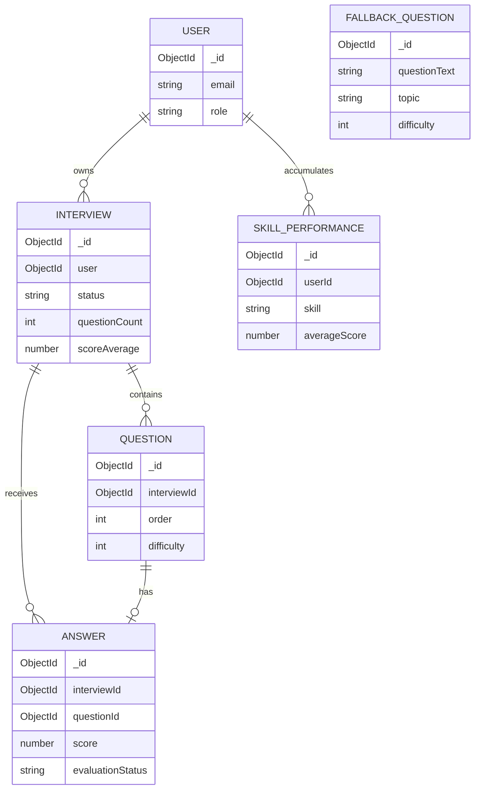

# Database Design

## 1. Database approach

The platform uses MongoDB with Mongoose. Each major domain concept has a model
under `backend/models`. References use MongoDB ObjectIds rather than embedding
entire interview histories in the user document. This keeps candidate profile
updates independent from growing interview data.

The database stores candidate work and internal evaluation data. API
serializers decide what is returned; a field being stored in MongoDB does not
mean that it is public.

## 2. Collections and fields

### `users`

| Field | Type | Rules / purpose |
|---|---|---|
| `_id` | ObjectId | MongoDB identifier |
| `name` | String | Required, trimmed |
| `email` | String | Required, lowercase, trimmed, unique |
| `password` | String | Required bcrypt hash; excluded by default from queries |
| `role` | String | `candidate` or `admin`; defaults to `candidate` |
| `education` | String | Optional profile information |
| `experience` | String | Optional profile information |
| `skills` | Array of String | Candidate profile skills |
| `resume` | String | Optional resume text |
| `createdAt`, `updatedAt` | Date | Mongoose timestamps |

### `interviews`

| Field | Type | Rules / purpose |
|---|---|---|
| `_id` | ObjectId | Interview identifier |
| `user` | ObjectId → User | Required owner reference |
| `jobRole` | String | Target role |
| `interviewType` | String | `technical`, `behavioral`, or `mixed` |
| `skills` | Array of String | Selected topics |
| `status` | String | `created`, `setup`, `in_progress`, or `completed` |
| `initialDifficulty` | String | `adaptive`, `easy`, `medium`, or `hard` |
| `currentDifficulty` | Number | 1 Easy, 2 Medium, 3 Hard |
| `topicDifficulties` | Array | Per-topic adaptive baselines |
| `difficultyProgression` | Array | `{ order, topic, difficulty, score }` history |
| `questionCount` | Number | Constrained to 3–15 |
| `completedQuestions` | Number | Progress count |
| `scoreAverage` | Number or null | Final score summary |
| `summary` | Object | Feedback and recommendations |
| `startedAt`, `completedAt` | Date | Session lifecycle timestamps |

### `questions`

| Field | Type | Rules / purpose |
|---|---|---|
| `_id` | ObjectId | Question identifier |
| `interviewId` | ObjectId → Interview | Required interview reference |
| `questionText` | String | Validated prompt text |
| `topic` | String | Backend-owned selected skill |
| `difficulty` | Number | 1–3, backend-owned |
| `questionType` | String | `conceptual`, `scenario`, `coding`, or `design` |
| `expectedConcepts` | Array of String | Private evaluator guidance |
| `order` | Number | Sequence position, at least 1 |
| `createdAt` | Date | Creation timestamp |

### `answers`

| Field | Type | Rules / purpose |
|---|---|---|
| `_id` | ObjectId | Answer identifier |
| `interviewId` | ObjectId → Interview | Required interview reference |
| `questionId` | ObjectId → Question | Required; unique to prevent duplicate answers |
| `userAnswer` | String | Trimmed candidate text |
| `score` | Number or null | Backend-calculated 0–100 score |
| `evaluationStatus` | String | `pending`, `completed`, or `failed` |
| `evaluation` | Mixed object | Validated dimensions and feedback |
| `submittedAt` | Date | Submission timestamp |

### `fallbackquestions`

| Field | Type | Rules / purpose |
|---|---|---|
| `_id` | ObjectId | Fallback question identifier |
| `questionText` | String | Required, 20–600 characters, unique |
| `topic` | String | Required, max 80 characters |
| `difficulty` | Number | 1–3 |
| `questionType` | String | One of four supported types |
| `expectedConcepts` | Array of String | Required evaluator guidance |
| `createdAt`, `updatedAt` | Date | Mongoose timestamps |

### `skillperformances`

| Field | Type | Rules / purpose |
|---|---|---|
| `user`, `userId` | ObjectId → User | Canonical and legacy-compatible references |
| `skill` | String | Skill/topic name |
| `attempts` | Number | Evaluated attempt count |
| `averageScore` | Number | Running average |
| `bestScore` | Number | Best observed score |
| `lastDifficulty` | Number | Latest attempt difficulty |
| `history` | Array | Interview reference, score, and date; capped by service |
| `createdAt`, `updatedAt` | Date | Mongoose timestamps |

## 3. Entity relationships

Skill-performance `history` items are embedded in their parent document, not a
separate collection. `FALLBACK_QUESTION` is not attached to a candidate
interview; its content is copied into an interview question when selected.

## 4. Indexes and integrity controls

- `users.email` is unique.
- `interviews.user + createdAt` supports candidate history ordering.
- `questions.interviewId` is indexed.
- `questions.interviewId + order` is unique.
- `answers.interviewId + submittedAt` supports ordered report retrieval.
- `answers.questionId` is unique and indexed.
- `fallbackquestions.questionText` is unique.
- `fallbackquestions.topic + difficulty` supports filtering.
- `skillperformances.user + skill` is unique.

Mongoose validation and controller validators provide application constraints.
Production still requires MongoDB backups, least-privilege credentials,
network restrictions, and migration discipline.

## 5. Privacy and access

Candidate interview access is checked against the authenticated user ID before
related questions and answers are read. Admin queries are behind admin-role
middleware. Password hashes are excluded from ordinary user queries and
sanitized responses. `expectedConcepts` are private evaluation data and are not
returned by candidate-facing question serializers.
