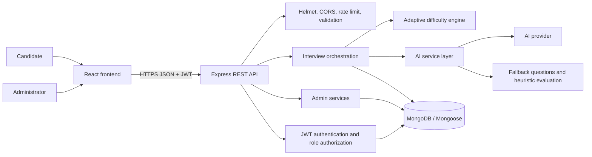
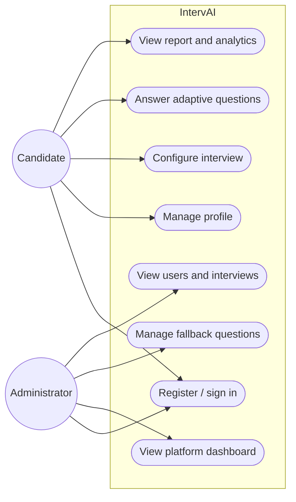
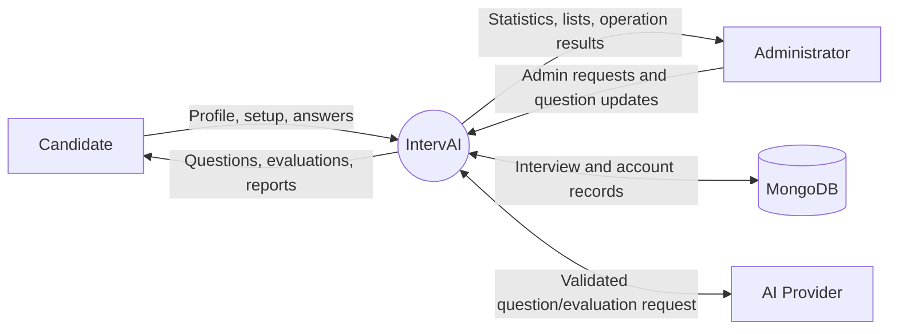
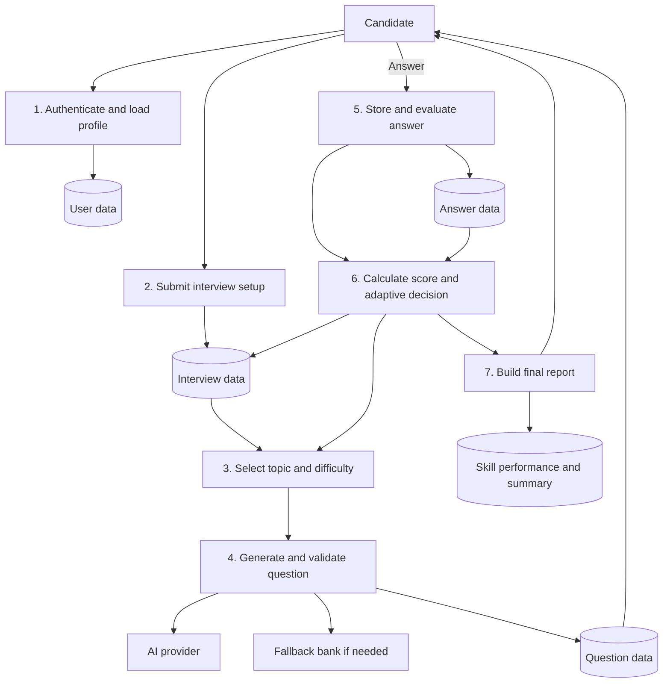
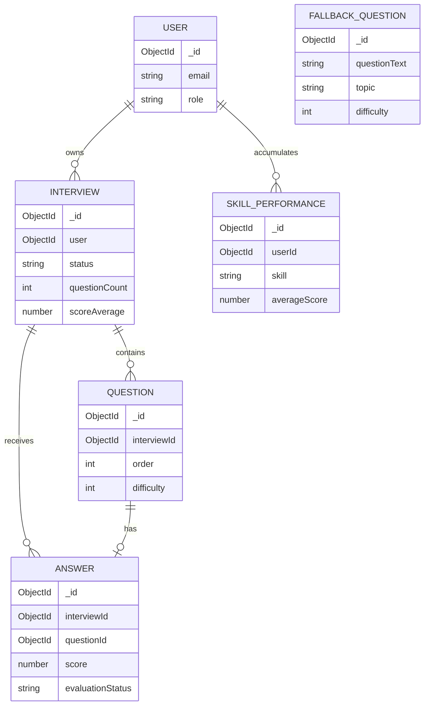
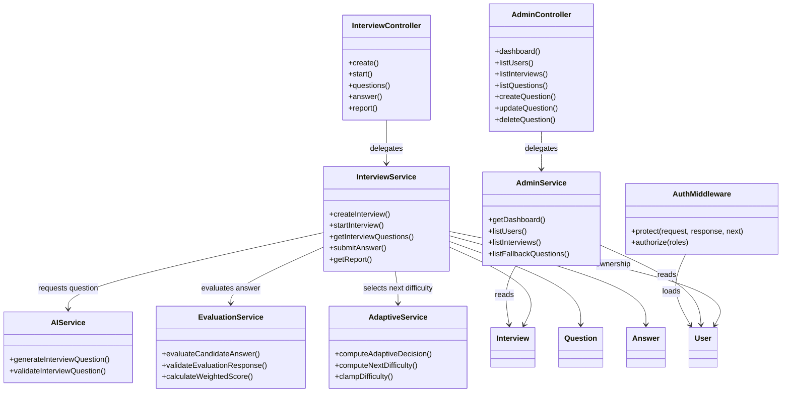
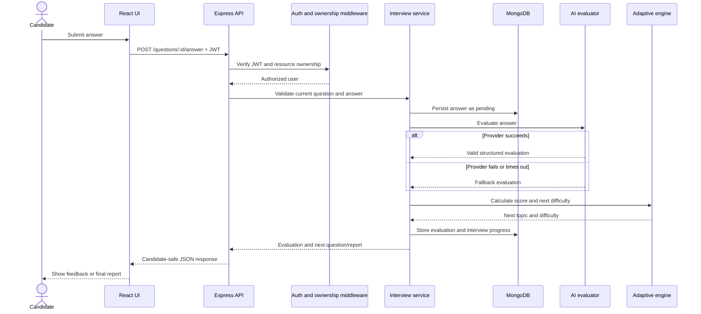
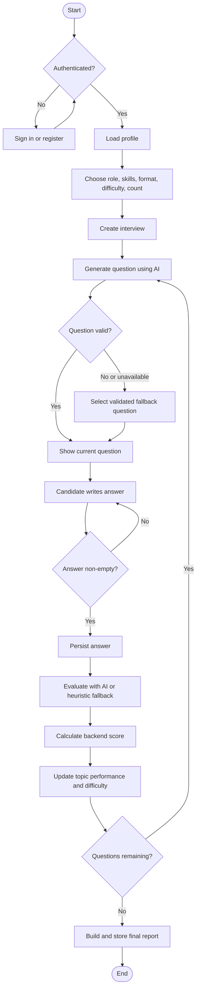

# Mermaid Diagrams

These diagrams describe the current MVP at a logical level. They are intended
for design review and university project documentation; they do not imply
features that are outside the implemented text-based workflow.

## 1. System Architecture Diagram

## 2. Use Case Diagram

Mermaid does not provide a universal native UML use-case syntax, so this
flowchart uses actors and a system boundary to express the same relationships.

## 3. DFD Level 0 (Context Diagram)

## 4. DFD Level 1 (Interview Session)

## 5. ER Diagram

## 6. Class Diagram

## 7. Sequence Diagram (Answer Submission)

## 8. Activity Diagram (Interview Lifecycle)

